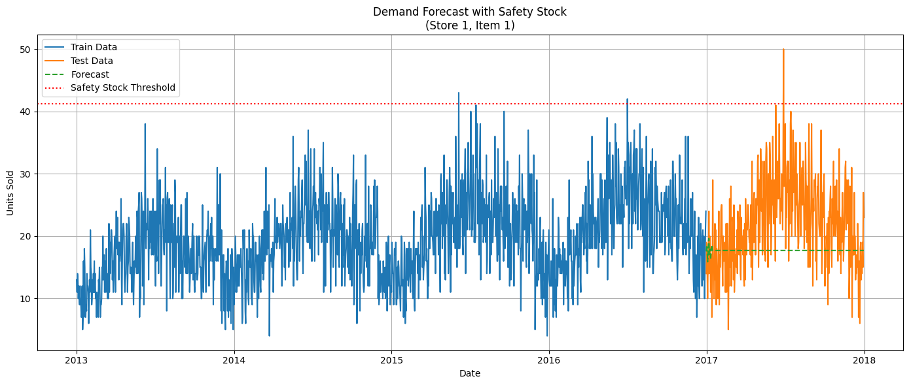

# demand-forecast-safety-stock

This project demonstrates how to forecast daily sales using StatsForecast (AutoARIMA) and calculate safety stock based on forecast uncertainty, with a real-world dataset from Kaggle.

## 📊 Project Goals

- Forecast daily product demand for a specific store-item using AutoARIMA
- Calculate safety stock based on forecast error and desired service level
- Visualize forecast results and inventory buffer threshold

## 📁 Dataset

- Source: [Kaggle - Demand Forecasting Dataset](https://www.kaggle.com/datasets/erogluegemen/demand-forecasting-dataset)
- Make sure to download and upload `train.csv` to your working directory before running the code.

## 🚀 How to Run

You can run this project in **two ways**:

### ✅ Option 1: Run on Google Colab (Recommended - No setup required)

[Open in Colab](https://colab.research.google.com/drive/1jg9INWunMs1Z3CoidnNBWSm-9JX7Ze1V?usp=sharing)

Just upload the `train.csv` file and execute all cells.

### 💻 Option 2: Run Locally with Virtual Environment

1. Create and activate a virtual environment (optional but recommended)

```bash
python -m venv venv
source venv/bin/activate  # On Windows: venv\Scripts\activate
```

2. Install dependencies

```bash
pip install -r requirements.txt
```

3. Run the script

```bash
python demand_forecasting_safety_stock.py
```

Or open the `.ipynb` notebook version (if provided) in Jupyter.

## 🔧 Tools Used

- Python, Pandas, Matplotlib, NumPy, Scipy
- [Nixtla/StatsForecast](https://github.com/Nixtla/statsforecast)

## 📌 Output

- 95% Service Level Safety Stock for a 7-day lead time
- Forecast visualization with demand buffer

## 📉 Results

- ✅ **Safety Stock (95% service level, 7-day lead time)**: `21.88 units`
- This means we should hold approximately **22 extra units** to avoid stockouts 95% of the time during a 7-day restocking period.

- The forecast was fitted using AutoARIMA and residuals were used to estimate demand uncertainty.
- The safety stock line (red dotted) is plotted over the fitted forecast and demand history.

> ⚠️ Note: You may see `SettingWithCopyWarning` from pandas when modifying slices. This does not affect results but can be suppressed or fixed using `.loc`.

### 📷 Forecast Visualization with Safety Stock

